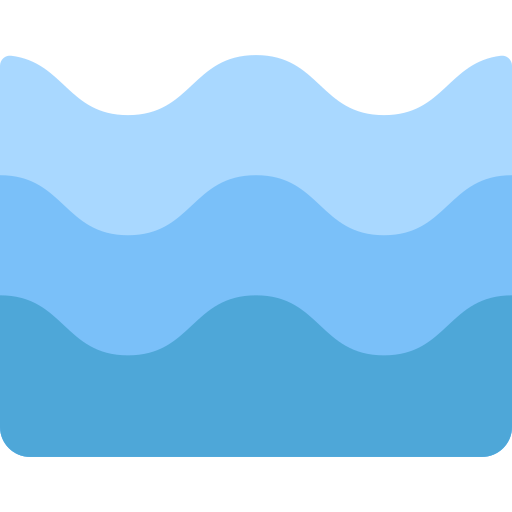

<div align="center">



# 🌊 Протокол Undertow

*Течение, которое невозможно остановить.*

[](https://www.rust-lang.org)
[](LICENSE)
[](https://github.com/daniil-verba/undertow-protocol)
<!-- [](https://discord.gg/rqJJf9WcV6) -->

**Текущая версия: v0.1.0** | [Список изменений](CHANGELOG.ru.md)

**Русский** | [English](README.md)

</div>

---

> P2P-протокол для децентрализованных приложений. Одна сеть. Нулевая конфигурация. NAT traversal из коробки.

## Что такое Undertow

**Undertow** — протокол для построения одноранговых (peer-to-peer) сетей, ориентированный на обмен сообщениями. Ключевая идея: **одна сеть для всех приложений**. Инди-разработчик подключает готовую библиотеку — и получает доступ к глобальной сети с DHT, NAT traversal и релейными маяками. Не нужно разворачивать собственную инфраструктуру.

Сеть работает как океанское течение: пользователи — это корабли с плавающими IP, серверы **Beacon** — маяки для навигации, узлы **Harbor** — порты для стабильного входа в сеть.

## Статус

🚧 **Ранний прототип** — активная разработка, API меняется ежедневно. Цель MVP: обмен сообщениями в LAN + NAT traversal.

## Почему Undertow, а не libp2p / WebRTC / DIY

| | Undertow | libp2p | WebRTC | DIY |
|---|---|---|---|---|
| **Готовая сеть** | ✅ Единая DHT + маяки | ❌ Расти самому | ❌ Только транспорт | ❌ Всё с нуля |
| **NAT traversal** | ✅ Из коробки | ⚠️ Сложно | ✅ Но нужен TURN | ❌ Строй сам |
| **Дружелюбие к инди** | ✅ Одна зависимость | ⚠️ 20+ крейтов | ⚠️ C++ / сложно | ❌ Месяцы работы |
| **Кроссплатформенность** | ✅ Rust | ✅ | ✅ Только браузер | ? |
| **Экономика** | ✅ Встроенная | ❌ Нет | ❌ Нет | ❌ Нет |

## Архитектура

```
┌─────────────────────────────────────────────────────────────┐
│                 ЕДИНАЯ СЕТЬ UNDERTOW                         │
│                                                              │
│   ┌─────────┐    ┌─────────┐    ┌─────────┐    ┌─────────┐ │
│   │ Игра A  │◄──►│ Клиент  │◄──►│ Discord │◄──►│Telegram │ │
│   │ (lib)   │    │ (TUI)   │    │  бот    │    │  бот    │ │
│   └────┬────┘    └────┬────┘    └────┬────┘    └────┬────┘ │
│        │              │              │              │        │
│   ┌────┴──────────────┴──────────────┴──────────────┴────┐ │
│   │              undertow-protocol (lib)                   │ │
│   │  ┌─────────┐  ┌─────────┐  ┌─────────┐  ┌─────────┐  │ │
│   │  │ Сеть    │  │   DHT   │  │ Крипто  │  │Протокол │  │ │
│   │  │(P2P,   │  │(Kademlia│  │(X25519, │  │(пакеты, │  │ │
│   │  │ NAT,   │  │ custom) │  │SHA-256) │  │ peer_id)│  │ │
│   │  │ relay) │  │         │  │         │  │         │  │ │
│   │  └─────────┘  └─────────┘  └─────────┘  └─────────┘  │ │
│   └─────────────────────────────────────────────────────────┘ │
│        │              │              │                        │
│   ┌────┴────┐    ┌───┴────┐    ┌───┴────┐                   │
│   │ Harbor  │    │ Beacon │    │ Beacon │  ← публичный VPS  │
│   │(бутстрап│    │(relay /│    │(relay /│    с белым IP     │
│   │  узел)  │    │rendezvous│   │rendezvous│                   │
│   └─────────┘    └────────┘    └────────┘                   │
└─────────────────────────────────────────────────────────────┘
```

## Модули

| Модуль | Статус | Описание |
|--------|--------|-------------|
| `network` | 🚧 В разработке | P2P-соединения, NAT traversal, hole punching, relay |
| `protocol` | 🚧 В разработке | Формат пакетов, `PeerId` (SHA-256 публичного ключа), сериализация (bincode) |
| `beacon` | 🚧 В разработке | Клиент для Beacon-серверов (rendezvous + relay) |
| `crypto` | 📋 Запланировано | E2E-шифрование чатов (X25519 + AEAD) |
| `storage` | 📋 Запланировано | Локальное хранилище чатов и контактов |
| `ui` | ✅ Готово | TUI-компоненты на ratatui (для Клиента) |
| `utils` | 📋 Запланировано | Логирование, хелперы |

## Фичер-флаги

```toml
[dependencies]
# Для кастомного приложения: выбирайте что нужно
undertow-protocol = { 
    git = "https://github.com/daniil-verba/undertow-protocol",
    default-features = false,
    features = ["network", "protocol", "storage"]
}
```

| Фича | Включает | Зависимости |
|---------|----------|-------------|
| `network` | P2P, NAT, STUN, hole punching, relay | tokio, mio, socket2 |
| `crypto` | X25519, SHA-256 | x25519-dalek, sha2, ring |
| `protocol` | PeerId, пакеты, bincode | serde, bincode |
| `storage` | Локальное хранилище | — |
| `ui` | TUI-компоненты | ratatui, crossterm |
| `beacon` | `network` + `crypto` + `protocol` | — |
| `client` | `network` + `crypto` + `protocol` + `storage` | — |

## Быстрый старт

### Минимальный пример

```rust
use undertow_protocol::{PeerId, Network};

#[tokio::main]
async fn main() -> Result<(), Box<dyn std::error::Error>> {
    // Создать идентификатор (генерирует X25519-ключевую пару)
    let peer_id = PeerId::generate();
    println!("Мой ID: {}", peer_id);

    // Подключиться к сети
    let network = Network::builder()
        .bootstrap("harbor.undertow.example:443")
        .connect()
        .await?;

    // Отправить сообщение
    network.send_to(peer_id, b"Привет, Undertow!").await?;

    Ok(())
}
```

### Полный пример

Смотрите [**Undertow-Client**](https://github.com/daniil-verba/undertow-client) — open-source TUI-мессенджер, демонстрирующий полный набор возможностей протокола.

## Экосистема

| Репозиторий | Назначение | Статус |
|------------|---------|--------|
| [undertow-protocol](https://github.com/daniil-verba/undertow-protocol) | Ядро библиотеки | 🚧 Прототип |
| [undertow-client](https://github.com/daniil-verba/undertow-client) | TUI-мессенджер, пример использования | 🚧 Прототип |
| [undertow-beacon](https://github.com/daniil-verba/undertow-beacon) | Релейный / rendezvous-сервер для VPS | 🚧 Прототип |

## Концепция «Один аккаунт — все приложения»

```
┌─────────────┐     ┌─────────────┐     ┌─────────────┐
│   Игра A    │     │   Клиент    │     │  Telegram   │
│  (wrapper)  │◄───►│  (TUI)      │◄───►│    бот      │
└──────┬──────┘     └──────┬──────┘     └──────┬──────┘
       │                   │                   │
       └───────────────────┼───────────────────┘
                           │
                    ┌──────┴──────┐
                    │  UTW Аккаунт  │
                    │   "Daniil"    │
                    │  PeerId + ключ │
                    └─────────────┘
                           │
       ┌───────────────────┼───────────────────┐
       │                   │                   │
  ┌────┴────┐         ┌────┴────┐         ┌────┴────┐
  │ Чат с   │         │ Чат с   │         │ Чат с   │
  │ Alice   │         │  Bob    │         │ Charlie │
  │(в игре) │         │(в клиенте│        │(в tg боте)│
  └─────────┘         └─────────┘         └─────────┘
  
  → Все сообщения из всех приложений в единой истории
  → Разработчик решает: показывать чат в своём UI или нет
```

## Терминология

| Термин | Значение |
|------|---------|
| **Undertow** | Подводное течение. Сеть, которую невозможно остановить или заблокировать |
| **Beacon** | Маяк. VPS-сервер с публичным IP: rendezvous (поиск пиров) + relay |
| **Harbor** | Порт. Бутстрап-узел для стабильного входа в сеть |
| **PeerId** | Хеш SHA-256 публичного ключа X25519. Уникальный идентификатор узла |
| **UTW** | Сокращение от Undertow |

## Дорожная карта

| Статус | Этап |
| :---: | :--- |
| ✅ | Структура проекта и фичер-флаги |
| ✅ | TUI-прототип (Клиент) |
| ✅ | Заглушка Beacon-сервера |
| 🔄 | Обмен сообщениями в LAN *(в процессе)* |
| 📋 | NAT traversal (STUN + hole punching) |
| 📋 | Релей через Beacon (аналог TURN) |
| 📋 | Криптография (X25519 + AEAD) |
| 📋 | DHT на базе Kademlia |
| 📋 | Сетевая экономика (кредиты, стимулы) |

## Требования

- **Rust** — последний стабильный (новее — лучше)
- **ОС** — Linux, macOS, Windows
- **Сеть** — UDP для P2P, TCP/WebSocket для Beacon

## 🤝 Присоединяйтесь к сообществу

Undertow создаётся разработчиками для разработчиков. Если вы хотите:

- 🐛 **Сообщить о баге** — [Открыть issue](https://github.com/daniil-verba/undertow-protocol/issues)
- 💡 **Предложить фичу** — [Начать обсуждение](https://github.com/daniil-verba/undertow-protocol/discussions)
- 💻 **Написать код** — Смотрите [good first issues](https://github.com/daniil-verba/undertow-protocol/issues?q=is%3Aissue+is%3Aopen+label%3A%22good+first+issue%22)
- 📚 **Улучшить документацию** — Нам тоже нужна помощь!

**Быстрый старт для контрибьюторов:**
```bash
git clone https://github.com/your-username/undertow-protocol.git
cd undertow-protocol
cargo build
cargo test
```

**Перед началом:**
- 📖 Прочитайте [Руководство по участию](CONTRIBUTING.ru.md)
- 📜 Прочитайте [Кодекс поведения](CODE_OF_CONDUCT.ru.md)

> 👋 Я — основатель. Лично ревьюю каждый PR и помогаю новым контрибьюторам начать. Никакой вклад не слишком мал. Присоединяйтесь к нам в [Discord](https://discord.gg/rqJJf9WcV6) — мы поможем найти ваш первый issue.

---

## 🌊 Видение

Мы строим сеть, которую невозможно остановить. Сеть, где разработчикам не нужно быть экспертами по инфраструктуре, а пользователи владеют своей идентичностью.

**Один протокол. Одна идентичность. Бесконечные приложения.**

---

## Контакты

- 📧 [daniilverba123@gmail.com](mailto:daniilverba123@gmail.com)
- 💬 [Discord](https://discord.gg/rqJJf9WcV6)
- 🐛 Issues — [GitHub](https://github.com/daniil-verba/undertow-protocol/issues)

---

## 📄 Лицензия

[MIT](LICENSE) — свободно использовать, модифицировать и распространять.

<div align="center">

*Undertow — течение, которое невозможно остановить.*

</div>
